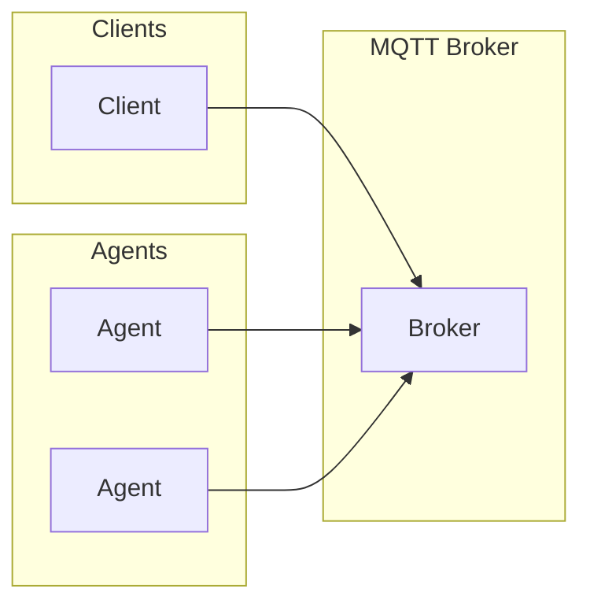

# Architecture

## Core Components

A2A over MQTT introduces a broker-centric transport model while keeping agent semantics unchanged:

### Agents

Agents publish a retained **Agent Card** to a discovery topic. The card describes the agent and may include optional trust metadata.

### Clients

Clients subscribe to discovery topics to find agents and publish requests to request topics. Replies are returned on corresponding reply topics.

### MQTT Broker

The broker routes discovery, request/reply, and event messages. It may optionally enforce trust policies for Agent Cards or inject broker-managed status metadata, but those choices are implementation-specific and not required for core conformance.
